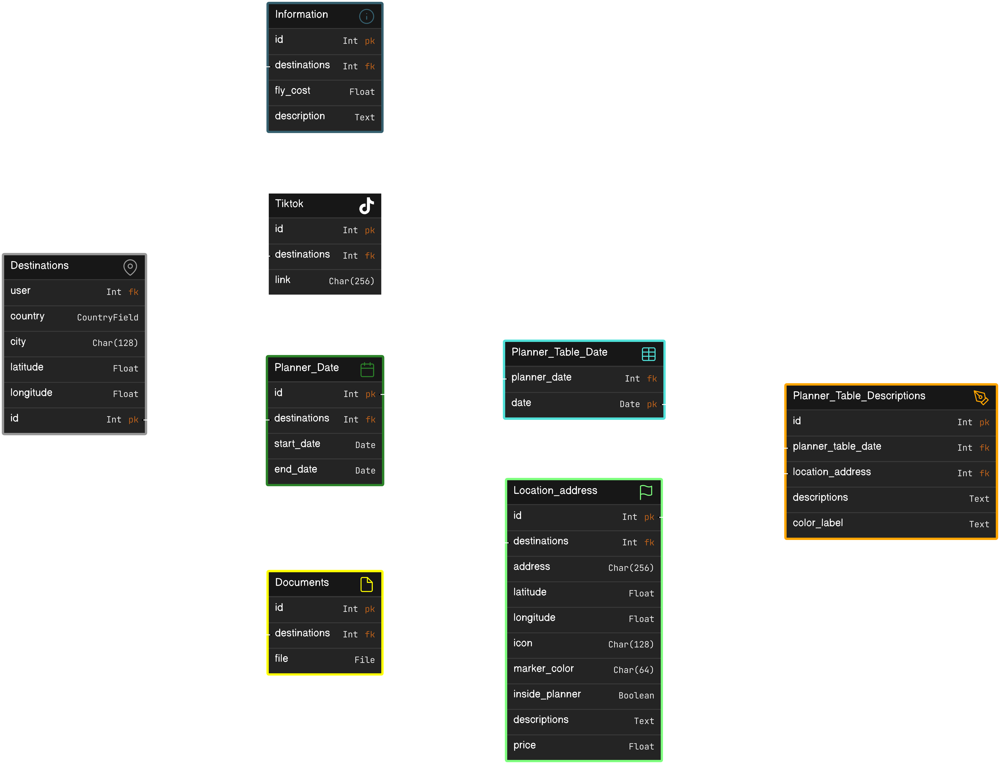

# :round_pushpin: General info
It's my first website made with Django framework. It contain simple ToDoList (made with tutorial when I was learning Django) and Travel-Manager (still work in progress). 
- **ToDoList** it is simple todo list where you can create your own list base on current user login, and you can add items to list, mark it done and remove.

- **Travel-Manager** this app is for people who's wanna manage travel by them. App contain map where you can add address, with information about price. You can also add descriptions. As you know many videos on TikTok shows some pro tips, so you can add TikTok link to your manager and watch them whenever you want. When you have address of your points you can make a planner. In planner you can drag your place and drop in table with date when you will go.

# Demo
Address: 18.168.226.200:8000 \
Login: test \
Password: r^@11@2@W4KJyy2h

# Environment
In `requirements.txt` you can find out all libs you need to run this project. Just simply create env:
```bash
python3 -m venv .env &
source .env/bin/activate &
pip3 install -r requirements.txt
```
Or install packages:
```bash
pip3 install -r requirements.txt
```

# Run project
To run project you need to be in `My_website/my_website`. Your dirs should looks like this:
```
├── My_website
   ├── my_website
      ├── board_games
      ├── htmlcov
      ├── main
      ├── my_website
      ├── register
      ├── static
      ├── travel_manager
      ├── utils
      ├── requirements.txt
      └── manage.py
   ├── .gitignore
   └── README.md
```
If you are in correct dir use this command:
- This command will create staticfiles directory
```bash
python3 manage.py collectstatic
```
- Next two command will create db.sqlite3 with tables 
```bash
python3 manage.py makemigrations
```
```bash
python3 manage.py migrate
```
- This command will start local server
```bash
python3 manage.py runserver
```
When everything is ok you should see this message:
```
System check identified no issues (0 silenced).
February 02, 2024 - 15:57:08
Django version 4.2, using settings 'my_website.settings'
Starting development server at http://127.0.0.1:8000/
Quit the server with CONTROL-C.
```
Now you should go to server address which is `http://127.0.0.1:8000/`.

# Database model
Travel manager DB


# Future updates
- **Travel-Manager**
    - Add feature in planner to manager time range on any attraction
    - Add feature to change order in planner tables
    - Add tests (Working right now) :bulb:
